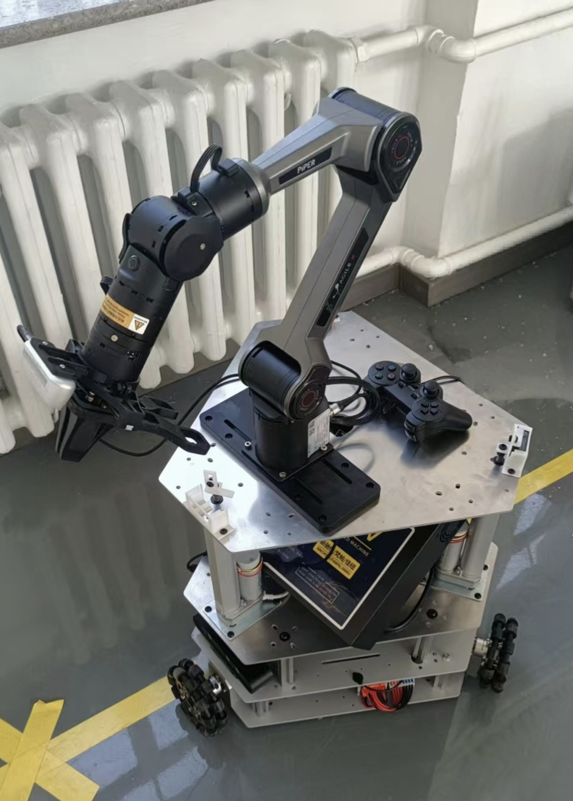
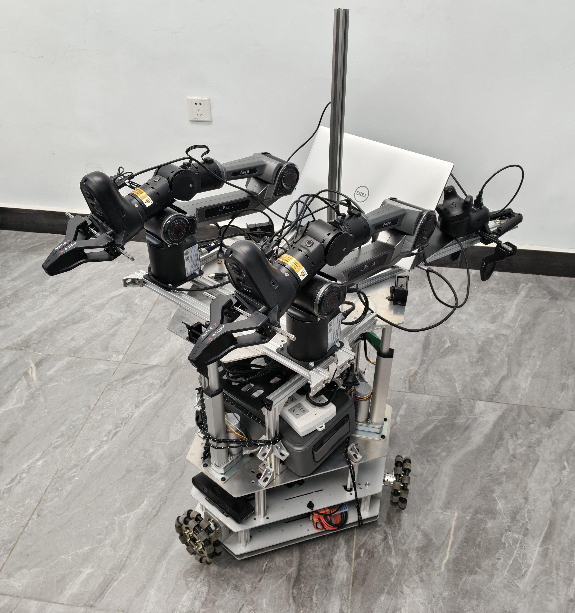
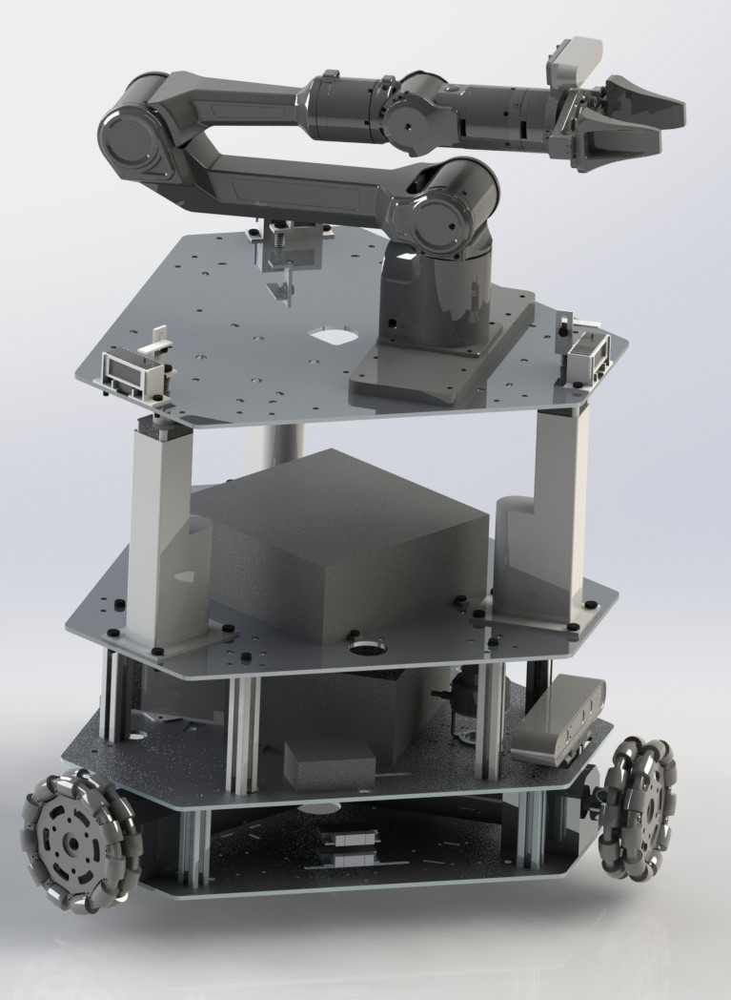
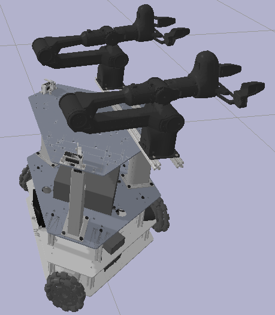
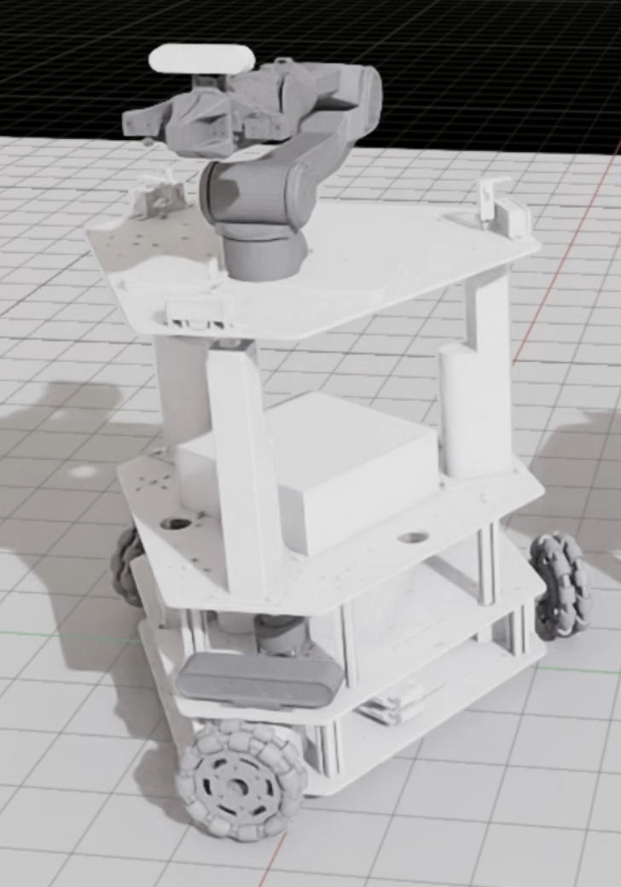

# MoPER
The **Mobile PiPER (MoPER)** is a modularized, holonomic robot designed specifically for indoor Embodied-AI tasks. It offers a versatile platform with multiple configurations to suit various research needs:
* **Mobile Base:** 4-DOF holonomic movement.
* **Single PiPER:** Mobile base + single arm (11-DOF).
* **Dual PiPER:** Mobile base + dual arms (18-DOF).

  
  

## Design & Extensibility
The MoPER robot features a spacious, multi-tiered design comprising four key sections:
1.  **Mobile Base**
2.  **Sensor Floor**
3.  **Extendable Floor**
4.  **Manipulation Floor**

This modular architecture ensures there are no strict space limitations when adjusting or adding hardware. This makes MoPER highly suitable for tasks such as **teleoperation**, **data collection**, and **model evaluation**.

> **Note:** For specific teleoperation setups, please refer to the [PieMoPER](https://github.com/shentan-shiina/piemoper) repository.

  

## Assets
We currently provide the following model formats for MoPER:

| Format   | Scope                                                       |
| :------- | :---------------------------------------------------------- |
| **STL**  | Model files for all assembly parts.                    |
| **URDF** | Available for Mobile Base, Single Arm, and Dual Arm setups. |
| **USD**  | Available for the Single Arm setup.                         |

  
  
  

## Miscellanous
1. **Adjustable Height:** We leverage 3 electric push rods for the extendable floor, allowing for dynamic height and space adjustment.
2. **Assembly:** For detailed assembly instructions, please contact us directly.
3. ...
